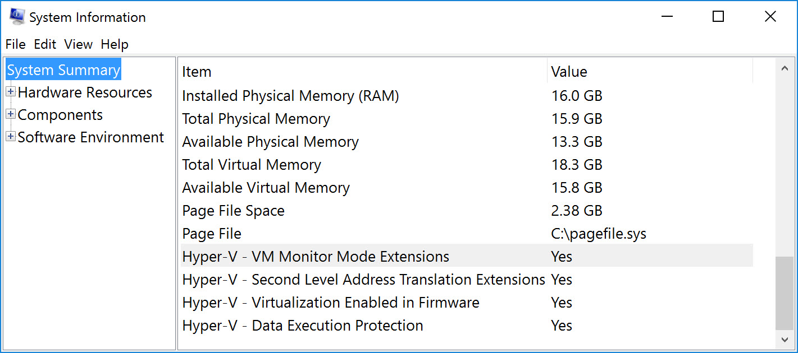

# WSL Setup for Day 1

Until 2 days, I had not done this setup. I wanted to go through the process so I could better prepare myself for the first day of class with y'all. This is a simple process, BUT it did take me some times. Other cohort members who have gone through this before might have done something different, so you are welcome to try that route. But this is what I would recommend.

## WARNING THIS IS ONLY FOR WINDOWS 10

### Hyper-V

Check out [this site](https://www.zdnet.com/article/windows-10-tip-find-out-if-your-pc-can-run-hyper-v/)
 for a break down on windows Hyper-V. This is the ability to run virtualized features.

If you want to skip this, hit your `Windows` key and type in `msinfo32`


Scroll to the bottom and you'll see something like this. You want have `Yes` for all 4 options.


The line `Virtualization Enabled in Firmware` is the ONLY line that you can possibly change and this is done through a BIOS option.

If this is the case, then you need to reboot your machine and open up your BIOS settings. You usually see this option on the initial POST of your machine bootup. It'll say something along the lines of `Hit F2 to enter Settings`. In my experience, `F2` and `Del` are the buttons that usually work, but check out the motherboard manufacturers website.
[This article](https://bce.berkeley.edu/enabling-virtualization-in-your-pc-bios.html) explains what settings you need to change to enable Virtualization on your PCU. I'm not aware if you can get around this if you're not able to enable it. Do some Googling!

### Install WSL - Simplified

I like simple solutions! I used the following 3 guides to get this setup. You will need to download all the most recent Windows updates to get this working.

* [Simplified Installation](https://docs.microsoft.com/en-us/windows/wsl/install-win10#simplified-installation-for-windows-insiders)

* [Windows Insider](https://insider.windows.com/en-us/getting-started)

* [Create Linux User](https://docs.microsoft.com/en-us/windows/wsl/user-support)

FYI - just do the `wsl --install` for Ubuntu, unless you really want something different that you know how to use.

This is the biggest chunk of time, at least it was for me. I think it took ~2 hours to intall updates and install the `Insider` version of Windows. But YMMV.

### Welcome to Ubuntu

Hit your Windows key and type `wsl`, and you should see the following.


Click that little guy and you'll open up the `WSL Terminal`.

In your terminal, type the following:

```bash
cd ~
explorer.exe .
```

The first command will take you to your root directory. The second should pop open your more familiar explorer. This will open up where you are currently, hence the space and "."
 (aside : my terminal is colored using Oh My Zsh, that's why it looks different from yours.)

My directory has been open for a while and I've done some work, so it looks much different from yours, but that's okay. Inside here is where you will be doing your work. The last bit of stuff to do now is create a directory (folder) for the class. Mine for my cohort was `DigitalCrafts`. I really do not advise coding outside of this environment! All of your work will be done in here. All of your installations will go here. Do yourself this favor! I promise! It sucks otherwise.

### VSCode

Now a caveat to the above statement ( get used to nuanced statements in coding. There is a lot of answers that begin with `it depends`!). You WILL install a copy of VsCode in your normal Windows environment and NOT inside Ubuntu.
Please, please, please, use VSCode. It is the best IDE for this class and I believe it is required. If you really like another IDE and REALLY know how to use it then you're on your own for the purpose of this guide.

Download [VsCode](https://code.visualstudio.com/).
You can read about developing inside of WSL with VsCode [here](https://code.visualstudio.com/docs/remote/wsl-tutorial) if you wish, but lets move forward.

Open VsCode.
`Ctrl + Shift + X` will open the extensions window in vscode.
Install this extension . This is required for your VSCode to work in WSL

### Other items

So the above work is the minimum, but lets get a few more things done

#### LinuxBrew

Go [here](https://docs.brew.sh/Homebrew-on-Linux) to a bit about `HomeBrew`. It's a fabulous little tool for install bash scripts

NOW we're going use [this site](https://www.how2shout.com/linux/install-brew-on-wsl-windows-subsystem-for-linux/) for installing the program.

```bash
sudo apt update
sudo apt-get install build-essential curl file git
/bin/bash -c "$(curl -fsSL https://raw.githubusercontent.com/Homebrew/install/master/install.sh)"
test -d ~/.linuxbrew && eval $(~/.linuxbrew/bin/brew shellenv)
test -d /home/linuxbrew/.linuxbrew && eval $(/home/linuxbrew/.linuxbrew/bin/brew shellenv)
test -r ~/.bash_profile && echo "eval \$($(brew --prefix)/bin/brew shellenv)" >>~/.bash_profile
echo "eval \$($(brew --prefix)/bin/brew shellenv)" >>~/.profile
```

Whew!
Now restart your terminal and test it out. Try running

```bash
brew update

```

You should be good to go. Which is great, because now....

#### Python

This is why we use WSL or HomeBrew.

```bash
sudo apt -y upgrade &&
sudo apt install -y python3-pip 
```

If you copy and paste that all and hit `Return` it should all run. Check to see if it worked by running `python3 -V` and `pip3 -V`.

#### Node.js

Again, just going to do this how Mircrosoft [suggests](https://docs.microsoft.com/en-us/windows/dev-environment/javascript/nodejs-on-wsl)

```bash
sudo apt-get install curl
curl -o- https://raw.githubusercontent.com/nvm-sh/nvm/v0.35.3/install.sh | bash
```

You might need to restart your terminal at this point. Check if `nvm` was installed by running `command -v nvm`. Should just return `nvm`

```bash
nvm install node
nvm install --lts
```

Verify that you have this correctly installed by typing `node -v` or `npm -v`

Alternatively, you can try this without `nvm` by typing.

```bash
curl -sL https://deb.nodesource.com/setup_14.x | sudo -E bash -
sudo apt-get install -y nodejs
```

## Conclusion

This should get you going in preparation for Day 1. Please attempt this before class. We can try and help you if you need it, but this does take a bit of time! Good luck and happy coding!
